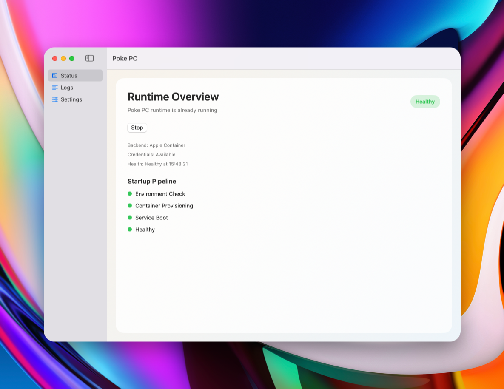

<div align="center">
  <h1>Poke PC</h1>
  
  <p>
    safely extend poke's capabilities to your machine with an isolated docker environment
  </p>

  <p align="center">
    Let your <a href="https://poke.com">Poke</a> AI assistant to work on a isolated fully containerized environment.<br>
    <sub>A community project — not affiliated with Poke or The Interaction Company.</sub>
  </p>
  
  <p>
    
    
    
    
  </p>
</div>

## macOS App

The macOS app is downloadable from [GitHub Releases](https://github.com/calganaygun/poke-pc/releases). 
Note: Apple notarization is still pending, so macOS may show a security warning on first launch.

If you see the warning:

1. Click `Done`.
2. Open `System Settings > Privacy & Security`.
3. Click `Open Anyway` for Poke PC, then confirm launch.

<p align="center">
  
</p>

## CLI
```bash
npx poke-pc
```

A Dockerized MCP worker with persistent terminal control, automatic Poke tunnel connection, and optional command status notifications to Poke.

License: MIT

## Introduce Poke PC to your Poke ⭐

Use this direct recipe link:

https://poke.com/r/kWWE0sbthIQ

You can also copy `RECIPE.md` into your Poke configuration.

## Quick Start 🚀

The command runs an interactive setup that:

- checks Docker
- runs Poke SDK device login if credentials are missing
- stores OAuth token in `~/.config/poke/credentials.json`
- asks if command status notifications to Poke should be enabled (default: yes)
- creates persistent volume and starts container in detached mode (no `--rm`)

Useful after setup:

```bash
docker logs -f poke-pc
docker exec -it poke-pc tail -f /root/poke-pc/terminal/history.ndjson
```

## Authentication 🔐

- Tunnel and notifications use the same OAuth token credentials from `~/.config/poke/credentials.json`.
- Quickstart uses Poke SDK device login to generate credentials automatically.
- No separate manual key setup is required.

If credentials are missing on first run, the app shows a login URL and code in logs.

## Manual Docker Run

```bash
docker run -d \
  --name poke-pc \
  -p 3000:3000 \
  -e POKE_TUNNEL_NAME="poke-pc" \
  -e MCP_PUBLIC_URL="http://127.0.0.1:3000/mcp" \
  -e POKE_PC_AUTOREGISTER_WEBHOOK="true" \
  -v poke_pc_state:/root/poke-pc \
  -v "$HOME/.config/poke:/root/.config/poke" \
  ghcr.io/calganaygun/poke-pc:latest
```

To run without command status notifications:

```bash
-e POKE_PC_AUTOREGISTER_WEBHOOK="false"
```

## Configuration

Copy `.env.example` and adjust as needed.

Common defaults:

- `POKE_TUNNEL_NAME=poke-pc`
- `MCP_HOST=0.0.0.0`
- `MCP_PORT=3000`
- `MCP_PUBLIC_URL=http://127.0.0.1:3000/mcp`
- `POKE_PC_AUTOREGISTER_WEBHOOK=true`

Bootstrap config can be loaded from file with `POKE_PC_BOOTSTRAP_CONFIG`.

## MCP Tools

- `terminal_create_session`
- `terminal_list_sessions`
- `terminal_run_command`
- `terminal_get_command_status`
- `terminal_capture_output`
- `terminal_kill_session`
- `terminal_list_commands`
- `filesystem_read_file` (blocks access under `~/.config`)

## Project docs

- CONTRIBUTING.md
- CODE_OF_CONDUCT.md
- SECURITY.md
- CHANGELOG.md
- RELEASE_CHECKLIST.md

## Local Development

```bash
npm install
npm run dev
```

## Build

```bash
npm run build
npm start
```

## Runtime behavior

Startup order:

1. Validate config and initialize state directories.
2. Initialize tmux manager and restore known sessions.
3. Run bootstrap commands.
4. Initialize command notification channel (load persisted or auto-register).
5. Start MCP server.
6. Start Poke tunnel with reconnection loop.
7. Start command monitor for adaptive heartbeat/completion notifications.

## Observability and command history

- Runtime app logs are emitted via pino to container stdout/stderr.
- Command/bootstrap lifecycle events are persisted in append-only NDJSON:
  - `/root/poke-pc/terminal/history.ndjson`
- This history file is intentionally logging-only and not exposed as an MCP tool.

Example:

```bash
docker exec -it poke-pc tail -f /root/poke-pc/terminal/history.ndjson
```

## CI/CD and release

- CI workflow: `.github/workflows/ci.yml`
- GHCR publish workflow: `.github/workflows/docker-publish.yml`
- GitHub release workflow: `.github/workflows/release.yml`

Published image path:

- `ghcr.io/calganaygun/poke-pc`

## Security notes

- Container currently runs as root by design for bootstrap flexibility.
- `filesystem_read_file` resolves real paths and blocks `~/.config` access to protect credentials.
- Persisted webhook token is stored in state path with mode `0600`.
- Logs redact common secret fields.

## Acknowledgements and Credits
- Inspired by the need for a more robust and persistent Poke work environment.
- Built with Node.js, Docker, and the Poke SDK.
- [Poke](https://poke.com) by [The Interaction Company of California](https://interaction.co)
- [Official Poke SDK](https://www.npmjs.com/package/poke)